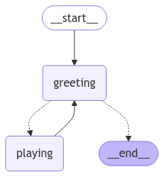

# Lang graph - Tutorials - Quick Start

## Part2: Enhancing the Chatbot with Tools

<https://langchain-ai.github.io/langgraph/tutorials/introduction/#requirements>

`.env`파일에 TAVILY_API_KEY 등록 필요

- `enhancing_chatbot_tools.py`: 공식문서의 전체 소스 코드

- `01.ect_invoke.py`: 공식문서의 전체 소스 코드의 graph를 invoke하여 결과 보기
- `02.ect_tavily.py`: TavilySearchResults 사용 하여 검색하기 기능 테스트
- `03.ect_toolnode.py`: ToolNode 이것 저것 해보기

- `04.ect_add_conditional_edges.py`: add_conditional_edges 이것 저것 해보기
- `05.ect_tools_condition.py`: tools_condition 기능 테스트

