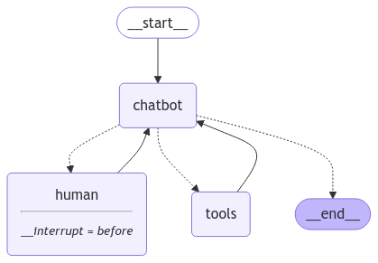

# Lang graph - Tutorials - Quick Start

## Part7: Time Travel

<https://langchain-ai.github.io/langgraph/tutorials/introduction/#part-7-time-travel>

- `time_travel.py`: 공식문서의 전체 소스 코드

- `01.tt_invoke.py`: 공식문서의 전체 소스 코드의 graph를 invoke하여 결과 보기
